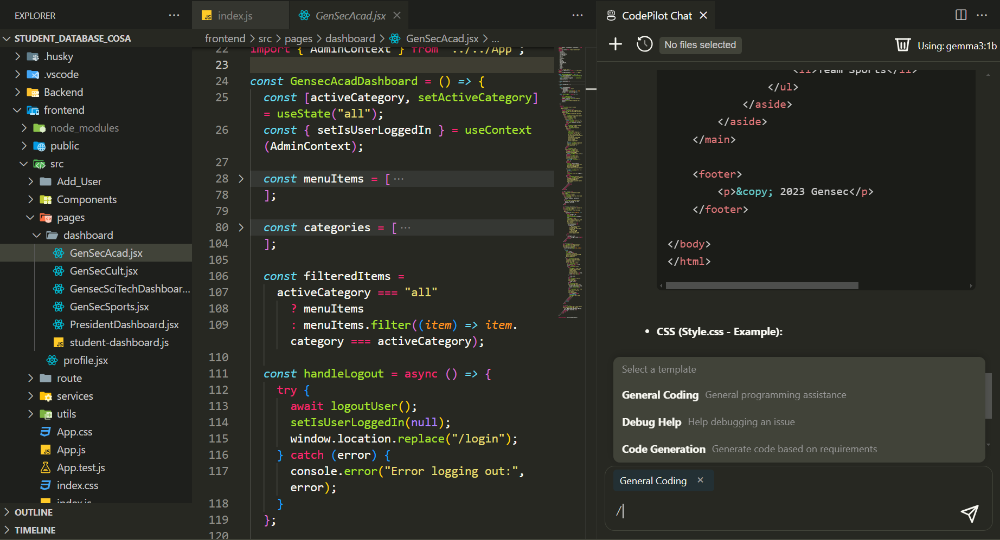

# CodePilot AI Assistant

CodePilot is a powerful AI coding assistant for VS Code that connects to Ollama models to provide intelligent code assistance directly in your editor.

## Features

- **AI Chat Interface**: Interact with AI models through a dedicated chat panel
- **Template System**: Choose from various specialized prompt templates for different coding tasks
- **Context-Aware**: Uses your current file or workspace as context for more relevant responses
- **Code Actions**: Right-click on code to explain, refactor, or document it with AI
- **Chat History**: Keep track of all your conversations with the AI
- **File Context**: Select specific files to include as context for your queries
- **Themes**: Automatically adapts to your VS Code theme

## Requirements

- VS Code 1.98.0 or higher
- [Ollama](https://ollama.com/) installed and running on your machine
- At least one model pulled in Ollama (recommended: codellama:7b-instruct)

## Installation

1. Install the extension from the VS Code Marketplace
2. Install [Ollama](https://ollama.com/) if you haven't already
3. Pull a model using Ollama (e.g., `ollama pull codellama:7b-instruct`)
4. Start Ollama on your machine
5. Configure the extension in VS Code settings

## Extension Settings

CodePilot contributes the following settings:

* `ai-assistant.ollamaEndpoint`: URL for your Ollama instance (default: "http://localhost:11434")
* `ai-assistant.model`: Default Ollama model to use (default: "codellama:7b-instruct")
* `ai-assistant.maxContextFiles`: Maximum number of files to include in context (default: 10)
* `ai-assistant.maxHistoryEntries`: Maximum number of chat histories to keep (default: 30)
* `ai-assistant.autoAssociateWorkspaces`: Automatically associate chats with the current workspace (default: true)

## Usage

### Starting a Chat

1. Press `Ctrl+Shift+P` (or `Cmd+Shift+P` on Mac) to open the command palette
2. Type "CodePilot: Chat" and press Enter
3. Type your question in the chat panel and press Enter

### Using Code Actions

1. Select some code in your editor
2. Right-click to open the context menu
3. Choose "Explain Code", "Refactor Code", or "Document Code"

### Using Templates

1. In the chat panel, type `/` to see available templates
2. Select a template to use for your next question
3. Type your specific question and press Enter

### Including File Context

1. Click the "No files selected" button in the chat panel
2. Select files to include as context for your queries
3. Ask your question with the selected files as context

## Tips

- Use the `/` command to access specialized templates for different tasks
- Include specific files as context when asking about larger projects
- Try different models for different types of tasks

## Release Notes

See the [CHANGELOG](CHANGELOG.md) for details about each release.

## Privacy & Data

CodePilot runs entirely locally and doesn't send your code to any external servers beyond your local Ollama instance.

## License

This extension is licensed under the MIT License.
