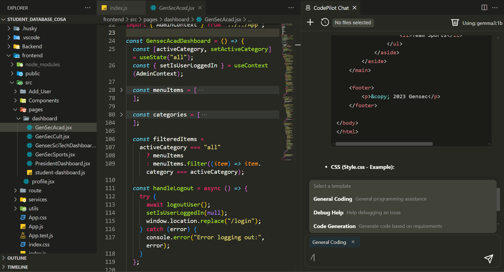

# CodePilot AI Assistant

CodePilot is a powerful AI coding assistant for VS Code that connects to Ollama models to provide intelligent code assistance directly in your editor. Designed to offer GitHub Copilot-like functionality with enhanced local AI capabilities.

## Features

- **🤖 Enhanced Inline Suggestions**: Smart code completions with improved context awareness and multi-line support
- **💬 AI Chat Interface**: Interact with AI models through a dedicated chat panel with file context
- **📁 Advanced File Indexing**: Semantic workspace indexing for better context and code understanding
- **✨ Next Edit Suggestions**: AI-powered suggestions for logical next steps in your code
- **🔍 Code Lens Actions**: Quick AI actions directly in your editor (explain, test, optimize functions)
- **💡 Smart Hover Insights**: AI-powered explanations when hovering over symbols
- **📝 Template System**: Choose from various specialized prompt templates for different coding tasks
- **🎯 Context-Aware**: Uses your current file, workspace, and related files for more relevant responses
- **⚡ Code Actions**: Right-click on code to explain, refactor, or document it with AI
- **📈 Chat History**: Keep track of all your conversations with the AI
- **🎨 File Context Selection**: Select specific files to include as context for your queries
- **🔒 Security Analysis**: Built-in security checks for your code
- **📊 Code Reviews**: Comprehensive AI-powered code reviews
- **🧪 Test Generation**: Automatic test case generation for functions and classes
- **🎨 Themes**: Automatically adapts to your VS Code theme

## Requirements

- VS Code 1.98.0 or higher
- [Ollama](https://ollama.com/) installed and running on your machine
- At least one model pulled in Ollama (recommended: codellama:7b-instruct)

## Installation

1. Install the extension from the VS Code Marketplace
2. Install [Ollama](https://ollama.com/) if you haven't already
3. Pull a model using Ollama (e.g., `ollama pull codellama:7b-instruct`)
4. Start Ollama on your machine
5. Configure the extension in VS Code settings

## Extension Settings

CodePilot contributes the following settings:

* `ai-assistant.ollamaEndpoint`: URL for your Ollama instance (default: "http://localhost:11434")
* `ai-assistant.model`: Default Ollama model to use (default: "codellama:7b-instruct")
* `ai-assistant.maxContextFiles`: Maximum number of files to include in context (default: 10)
* `ai-assistant.maxHistoryEntries`: Maximum number of chat histories to keep (default: 30)
* `ai-assistant.autoAssociateWorkspaces`: Automatically associate chats with the current workspace (default: true)

## Usage

### Enhanced Code Completion

CodePilot provides intelligent inline suggestions as you type:
- Enhanced context awareness using workspace file indexing
- Multi-line completion support
- Language-specific optimizations
- Automatic caching for improved performance

### Next Edit Suggestions

Get AI-powered suggestions for your next logical code changes:
1. Press `Ctrl+Alt+N` (or `Cmd+Alt+N` on Mac) to get next edit suggestions
2. Select from the suggested improvements and let AI implement them
3. Or use the "✨ Suggest Next Edit" code lens at the top of files

### Code Lens Actions

Interact with AI directly in your editor:
- **🤖 AI Explain**: Get explanations for functions and classes
- **🧪 Generate Tests**: Create comprehensive test cases
- **⚡ AI Optimize**: Get optimization suggestions for your code
- **📝 Generate Docs**: Create documentation for classes and interfaces
- **🔍 AI Code Review**: Get comprehensive code reviews
- **🔒 Security Check**: Analyze code for security vulnerabilities

### Smart Hover Insights

Hover over symbols to get AI-powered insights:
- Explanations of functions, classes, and variables
- Type information and usage notes
- Quick links to related actions

### Starting a Chat

1. Press `Ctrl+Alt+A` (or `Cmd+Alt+A` on Mac) to open the chat
2. Or press `Ctrl+Shift+P` and type "CodePilot: Chat"
3. Type your question in the chat panel and press Enter

### Using Code Actions

1. Select some code in your editor
2. Right-click to open the context menu
3. Choose "Explain Code", "Refactor Code", or "Document Code"
4. Or use keyboard shortcuts: `Ctrl+Alt+E` (explain), `Ctrl+Alt+R` (refactor), `Ctrl+Alt+D` (document)

### Using Templates

1. In the chat panel, type `/` to see available templates
2. Select a template to use for your next question
3. Type your specific question and press Enter

### File Indexing and Context

CodePilot automatically indexes your workspace for better context:
- Semantic analysis of symbols, functions, classes, and imports
- Automatic relationship detection between files
- Smart context selection for AI queries
- Use `Ctrl+Shift+P` → "CodePilot: Rebuild File Index" to refresh
- Check indexing status with "CodePilot: Show Index Statistics"

### Including File Context

1. Click the "No files selected" button in the chat panel
2. Select files to include as context for your queries
3. Ask your question with the selected files as context

## Keyboard Shortcuts

- `Ctrl+Alt+A` (`Cmd+Alt+A`): Open AI Chat
- `Ctrl+Alt+I` (`Cmd+Alt+I`): Toggle Inline Suggestions
- `Ctrl+Alt+N` (`Cmd+Alt+N`): Suggest Next Edit
- `Ctrl+Alt+S` (`Cmd+Alt+S`): Select AI Model
- `Ctrl+Alt+E` (`Cmd+Alt+E`): Explain Selected Code
- `Ctrl+Alt+R` (`Cmd+Alt+R`): Refactor Selected Code
- `Ctrl+Alt+D` (`Cmd+Alt+D`): Document Selected Code

## Tips

- Use the `/` command to access specialized templates for different tasks
- Include specific files as context when asking about larger projects
- Try different models for different types of tasks
- Use Code Lens actions for quick AI interactions
- Hover over symbols to get instant AI explanations
- Let the file indexing complete for best context understanding

## Release Notes

See the [CHANGELOG](CHANGELOG.md) for details about each release.

## Privacy & Data

CodePilot runs entirely locally and doesn't send your code to any external servers beyond your local Ollama instance.

## License

This extension is licensed under the MIT License.
